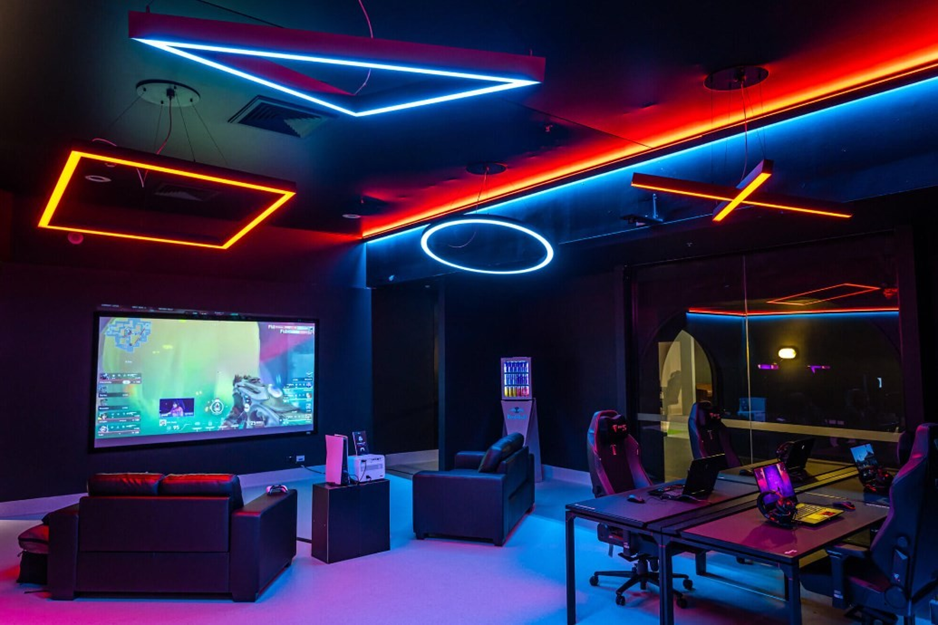

# InteractiveLighting

# Content

* What's our goal?
* How does it work?
* Features
* Requirements
  * Hardware
  * Software
* End conclusion
* Members

## What's our goal?

We were given the task to make lighting for a gaming room that users can interact with in different ways. This will affect the coloring and patern of the lighting.

## How does it work?

We use multiple led strips that are connected to the gaming setup and these will project different lighting paterns depending on what sound is made in the game you're playing. 

## Features

## Software we used

* Arduino
* Wled
* Fusion 360

## Hardware we used

* ESP32
* 24V voeding
* DC/DC Converter
* WS2812 Ledstrip
* Plafond Ophangoog
* JST Connector
* Straaldraad
* LedProfielen

## Our webpage

We've put together a website that lets you take full control of your lights. There are different sections for controlling your LED settings like the color, brightness and to turn them on/off (Home page), or choose a cool effect (Effects page), and even learning a bit about what inspired us to create this (About page).

### Frontend

#### Home page

On this page you can control the general led settings. The solid color, the brightness and a button to turn them on or off. There is also a random effect button.
There is a left side and a right side. On the left side there is a big colorpicker to choose your own color. Next to the colorpicker there are 4 button for pure blue, red, green or white color.
On the right side, there is a button to turn the lights on or off. Below you can choose the brightness and a random effect.

#### Effect page

Here you can search or look for a cool effect. On the top there is a search bar to look for an effect, but you can also scroll to all the available effects.

#### About page

This is an about page where you can find information about the project.

## End conclusion

## Members

* Ibe Packo
* Lennart Fonteyne
* Yarno Otte
* Joren Vandewalle
